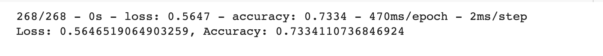
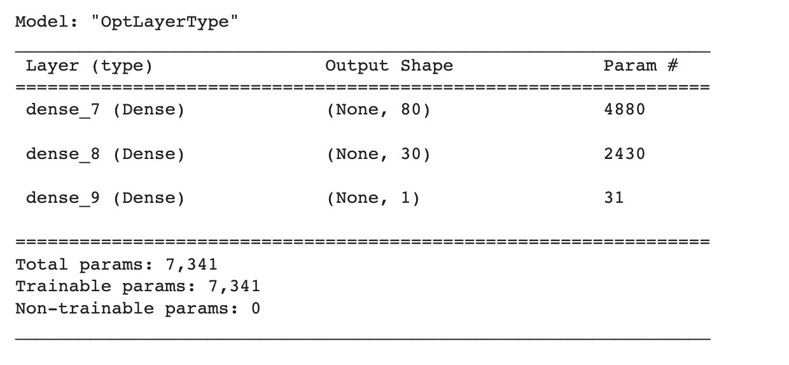

# DU Data Analysis Module 21 - Deep Learning
The nonprofit foundation Alphabet Soup wants a deep learning model that can help it select the applicants for funding with the best chance of success in their ventures. This project is a binary classifier that predicts whether applicants will be successful if funded by Alphabet Soup.

## Model Overview
*alphabet_soup.ipynb* contains a keras 3-layer deep-learning binary classifier.
The provided data set *charity_data.csv* contains more than 34,000 organizations that have received funding from Alphabet Soup over the years, some features of their project and whether or not they were successful.
*alphabet_soup.ipynb* does the following:
* Consolidates features with more than 10 unique values through re-binning
* Encodes categorical variables using *pd.get_dummies()*
* Scales the features using StandardScaler()
* Creates the binary classifier
* Trains the classifier on a portion of the data
* Evaluates the classifier on the remaining data

## Results

The original binary classifier achieves an accuracy of 72.95%.
Model changes were made with the goal of increasing the model's accuracy to 75%. However, little accuracy increase was achieved. The maximum accuracy achieved was 73.34%

On a model with 3 layers:
* A dense input layer of 80 neurons using the relu activation algorithm
* A dense hidden layer of 30 neurons using the relu activation algorithm
* A dense output layer of 1 neuron using the sigmoid activation algorithm

### Data Processing
The target variable *IS_SUCCESSFUL* tells whether the start-up venture was successful or not.
The features of the model are:
* APPLICATION_TYPE
* AFFILIATION
* CLASSIFICATION
* USE_CASE
* ORGANIZATION
* STATUS
* INCOME_AMT
* SPECIAL_CONSIDERATIONS
* ASK_AMT

The EIN and NAME of the applicant organization were removed from the model because they are neither targets nor features.

### Compiling, Training and Evaluating the Model

#### Original Model
The original model is a keras binary classifier containing the following layers:
* A dense input layer of 80 neurons using the relu activation algorithm
* A dense hidden layer of 30 neurons using the sigmoid activation algorithm
* A dense output layer of 1 neuron using the sigmoid activation algorithm

A model with an input layer, one hidden layer and an output layer was selected as good place to start given that an input layer and an output is the minimum configuration. Neuron numbers start with a higher number and decrease across the layers down to the single neuron that is required for the output layer.
The sigmoid activation algorithm was chosen since it naturally lends itself to binary classification. Tanh is also a binary algorithm. Attempts at optimization using tanh instead of the sigmoid function did not result in greater accuracy.

The original model attained an accuracy level of 72.95%

#### Optimization

*AlphabetSoupCharity_Optimization.ipynb* reflects attempts at optimizing for greater accuracy. The goal was 75%. The following approaches were attempted for optimization with very little success in achieving greater accuracy:
* The application type and classification were re-binned to use lower cutoffs of 50 and 30 respectively, resulting in more bins. This optimization increased accuracy slightly from 72.95% to 73.06%.
* The sigmoid function was replace with relu in the hidden layer. Accuracy increased very slightly from 73.06% to 73.34%
* An additional hidden layer was added to the model and neuron numbers were increased about an order of magnitude. This change actually decreased accuracy very slightly from 73.34% to 73.08%
* Additional optimizations attempted that are not reflected in *AlphabetSoupCharity_Optimization.ipynb* were: changing the sigmoid function to tanh, lowering the cutoff for application type and classification even further, adding even more neurons and layers and finally increasing the number of epochs.

The model was not able to achieve the target accuracy of 75%.

## Summary
The binary classifier was able to achieve a maximum accuracy of 73.34%.

One potential way to improve the accuracy of this model further would be to investigate where prediction is failing. Analysis of the failed predictions could lead to finding features that are contributing to making incorrect predictions. If that's the case, eliminating those features from the model would increase accuracy.
